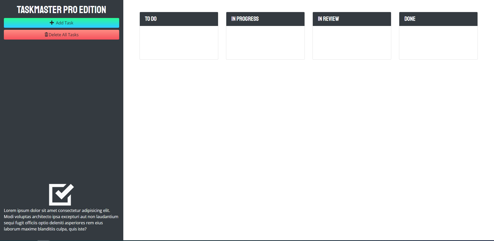

# taskmaster-pro

- Github URL: https://github.com/DanielCConlon/taskmaster-pro
- github pages: https://danielcconlon.github.io/taskmaster-pro/

## Table-of-Contents

- [Description](#description)
- [Usage](#usage)
- [Application](#application)

## [Description](#description)

Taskmaster is a task-managment application created following a course module on Jquery and Bootstrap.

## [Usage](#table-of-contents)

Open the website and you can add/delete a task using the buttons. You can also drag a task to the different status'.

## [Application](#table-of-contents)

